# TemanNetra

TemanNetra is a mobile application developed as a Final Project for the Mobile Programming (Pemrograman Perangkat Bergerak / PPB - E) course. The project provides assistive features for visually impaired individuals and coordination tools for volunteer assistants.

## 🎯 SDG Alignment
* **Target Focus**: **SDG 10: Reduced Inequalities**.
* **Objective**: Facilitate daily independent tasks for visually impaired individuals by offering automated visual analysis and a remote volunteer assistance channel.

## 👥 Development Team & Feature Division
The codebase is structured around a Feature-First modular design. Functional CRUD operations connected to Cloud Firestore and Firebase Storage are allocated as follows:

### Member 1: Naswan Nashir (NRP 5025231246)
* **Module**: Visually Impaired Assistant (Client Side)
* **CRUD Scope**:
  - **Create**: Capture visual data via camera, process text recognition using the Gemini API, or submit an assistance ticket to Cloud Firestore.
  - **Read**: Fetch and playback the user's historical ticket list.
  - **Update**: Modify active ticket descriptions or re-evaluate local visual text analysis.
  - **Delete**: Remove past ticket logs from the database for user privacy.

### Member 2: Sultan Alif Ibrahim A. (NRP 5025231219)
* **Module**: Volunteer Dashboard (Volunteer Side)
* **CRUD Scope**:
  - **Create**: Send text responses, record and upload voice notes to Supabase Storage, and trigger notifications for relevant assistance-request updates.
  - **Read**: Fetch active unresolved assistance requests, chat messages, voice notes, and notifications.
  - **Update**: Claim or resolve an assistance request and update its execution status.
  - **Delete**: Cancel a claimed assistance request before it is resolved.

## ♿ Accessibility Specifications
The interface is designed to support baseline accessibility parameters:
* **Semantics**: Wrapped critical interactive components in Flutter's `Semantics` widget for TalkBack/VoiceOver compatibility.
* **Contrast**: High-contrast black and gold themes to assist low-vision users.
* **Tap Targets**: Touch targets conform to a minimum size of 64x64 dp to reduce misclicks.
* **Haptics**: Brief vibration triggers upon successful database actions.

## 🔌 Architecture & Core Tech Stack
* **State Management**: Riverpod (via code generation).
* **Authentication, Database & Storage**: Firebase Authentication, Cloud Firestore, and Supabase Storage.
* **APIs**: Gemini Developer API (OCR/Text recognition) and Firebase Cloud Messaging (FCM).

## 📊 Class Diagram
The following class diagram represents the modular, clean architecture of TemanNetra, showing the relationships across the Authentication, AI Assistant, Help Request, and Volunteer modules along with shared accessibility utility services:

```mermaid
classDiagram
    class UserRole {
        <<enumeration>>
        tunanetra
        volunteer
        +fromString(String value) UserRole
    }

    class UserModel {
        +String uid
        +String email
        +String name
        +UserRole role
        +copyWith(uid, email, name, role) UserModel
        +toMap() Map
        +fromMap(Map map) UserModel
    }

    class AuthRepository {
        <<interface>>
        +Stream~UserModel?~ authStateChanges
        +signInWithEmailAndPassword(String email, String password) Future~UserModel~
        +signUpWithEmailAndPassword(String email, String password, String name, UserRole role) Future~UserModel~
        +getCurrentUserData() Future~UserModel?~
        +signOut() Future~void~
    }

    class AuthRepositoryImpl {
        -_firebaseAuth FirebaseAuth
        -_firestore FirebaseFirestore
        +_fetchUserData(String uid) Future~UserModel?~
    }

    class AuthController {
        +build() Stream~UserModel?~
        +signIn(String email, String password) Future~void~
        +signUp(String email, String password, String name, UserRole role) Future~void~
        +signOut() Future~void~
    }

    class AiResult {
        +String text
        +String sceneDescription
        +DateTime timestamp
        +copyWith(text, sceneDescription, timestamp) AiResult
        +toMap() Map
        +fromMap(Map map) AiResult
    }

    class AiRepository {
        <<interface>>
        +analyzeImage(Uint8List imageBytes) Future~AiResult~
    }

    class AiRepositoryImpl {
        -_model GenerativeModel
    }

    class AiAssistantController {
        +build() FutureOr~AiResult?~
        +processImage(Uint8List imageBytes) Future~void~
        +clearResult() void
    }

    class TtsService {
        -_flutterTts FlutterTts
        +speak(String text) Future~void~
        +stop() Future~void~
    }

    class HapticService {
        +vibrateClick() Future~void~
        +vibrateSuccess() Future~void~
        +vibrateError() Future~void~
    }

    class AiAssistantScreen {
        <<stateful>>
        -_cameraController CameraController
        -_initializeCamera() Future~void~
        -_takePictureAndAnalyze() Future~void~
    }

    class HelpRequestStatus {
        <<enumeration>>
        pending
        claimed
        resolved
        +fromString(String value) HelpRequestStatus
    }

    class HelpRequestModel {
        +String id
        +String requesterId
        +String requesterName
        +String description
        +HelpRequestStatus status
        +String? volunteerId
        +String? volunteerName
        +DateTime createdAt
        +DateTime? resolvedAt
        +copyWith() HelpRequestModel
        +toMap() Map
        +fromMap(Map map, String documentId) HelpRequestModel
    }

    class HelpRequestRepository {
        <<interface>>
        +getMyHelpRequests() Stream~List~HelpRequestModel~~
        +createHelpRequest(String description) Future~void~
        +getOrCreateActiveHelpRequest() Future~HelpRequestModel~
        +updateHelpRequestDescription(String id, String description) Future~void~
        +deleteHelpRequest(String id) Future~void~
    }

    class HelpRequestRepositoryImpl {
        -_firestore FirebaseFirestore
        -_auth FirebaseAuth
        +getOrCreateActiveHelpRequest() Future~HelpRequestModel~
        -_createHelpRequestWithDescription(String description) Future~HelpRequestModel~
    }

    class HelpRequestController {
        +build() Stream~List~HelpRequestModel~~
        +createTicket(String description) Future~void~
        +getOrCreateActiveHelpRequest() Future~HelpRequestModel~
        +updateTicket(String id, String description) Future~void~
        +deleteTicket(String id) Future~void~
    }

    class ChatMessageModel {
        +String id
        +String senderId
        +String senderName
        +String? messageText
        +String? messageUrl
        +DateTime createdAt
        +toMap() Map
        +fromMap(Map map, String documentId) ChatMessageModel
    }

    class VolunteerRepository {
        <<interface>>
        +watchPendingHelpRequests() Stream~List~HelpRequestModel~~
        +watchMyClaimedHelpRequests() Stream~List~HelpRequestModel~~
        +watchChatMessages(String requestId) Stream~List~ChatMessageModel~~
        +claimHelpRequest(String requestId) Future~void~
        +resolveHelpRequest(String requestId) Future~void~
        +cancelClaim(String requestId) Future~void~
        +sendTextMessage(String requestId, String messageText) Future~void~
        +sendVoiceMessage(String requestId, String voicePath) Future~void~
    }

    class VolunteerRepositoryImpl {
        -_firestore FirebaseFirestore
        -_auth FirebaseAuth
        -_voiceNoteStorageService VoiceNoteStorageService
        -_getCurrentVolunteerName(String uid) Future~String~
        -_validateTicketClaimedByCurrentVolunteer(DocumentReference ticketDocRef, String currentUserId) Future~void~
    }

    class VolunteerController {
        +build() FutureOr~void~
        +claimHelpRequest(String requestId) Future~void~
        +resolveHelpRequest(String requestId) Future~void~
        +cancelClaim(String requestId) Future~void~
        +sendTextMessage(String requestId, String messageText) Future~void~
        +sendVoiceMessage(String requestId, String voicePath) Future~void~
    }

    class VoiceNoteStorageService {
        -_clientOverride SupabaseClient?
        -_uuid Uuid
        +uploadVoiceNote(String requestId, String localFilePath) Future~String~
        -_sanitizePathSegment(String value) String
    }

    class AudioMessagePlayer {
        <<stateful>>
        +String audioUrl
        +bool autoPlay
        +VoidCallback? onAutoPlayStarted
    }

    class VoiceNoteButton {
        <<stateful>>
        +Future~void~ Function(String) onVoiceReady
        +bool isDisabled
        +bool fullWidth
        +double height
        +double fontSize
    }

    class CreateHelpRequestScreen {
        <<stateless>>
    }

    class EditHelpRequestScreen {
        <<stateless>>
    }

    class HelpRequestHistoryScreen {
        <<stateless>>
    }

    class VolunteerDashboardScreen {
        <<stateless>>
    }

    class ActiveClaimScreen {
        <<stateless>>
    }

    class HelpRequestDetailScreen {
        <<stateful>>
        +HelpRequestModel ticket
    }

    UserModel --> UserRole
    AuthRepositoryImpl ..|> AuthRepository
    AuthRepositoryImpl --> UserModel
    AuthController --> AuthRepository
    AuthController --> UserModel

    AiRepositoryImpl ..|> AiRepository
    AiRepositoryImpl --> AiResult
    AiAssistantController --> AiRepository
    AiAssistantController --> AiResult

    AiAssistantScreen --> AiAssistantController : ref.watch
    AiAssistantScreen --> TtsService : ref.read
    AiAssistantScreen --> HapticService : ref.read

    HelpRequestModel --> HelpRequestStatus
    HelpRequestRepositoryImpl ..|> HelpRequestRepository
    HelpRequestRepositoryImpl --> HelpRequestModel
    HelpRequestController --> HelpRequestRepository
    HelpRequestController --> HelpRequestModel

    VolunteerRepositoryImpl ..|> VolunteerRepository
    VolunteerRepositoryImpl --> HelpRequestModel
    VolunteerRepositoryImpl --> ChatMessageModel
    VolunteerRepositoryImpl --> VoiceNoteStorageService
    VolunteerController --> VolunteerRepository
    VolunteerController --> HelpRequestModel
    VolunteerController --> ChatMessageModel

    CreateHelpRequestScreen --> HelpRequestController : ref.read
    EditHelpRequestScreen --> HelpRequestController : ref.read
    HelpRequestHistoryScreen --> HelpRequestController : ref.watch
    VolunteerDashboardScreen --> VolunteerController : ref.read
    ActiveClaimScreen --> VolunteerController : ref.read
    ActiveClaimScreen --> ChatMessageModel : ref.watch(chatMessages)
    ActiveClaimScreen --> AudioMessagePlayer
    ActiveClaimScreen --> VoiceNoteButton

    HelpRequestDetailScreen --> HelpRequestModel
    HelpRequestDetailScreen --> ChatMessageModel : StreamBuilder
    HelpRequestDetailScreen --> VoiceNoteStorageService
    HelpRequestDetailScreen --> AudioMessagePlayer
    HelpRequestDetailScreen --> VoiceNoteButton
    HelpRequestDetailScreen --> TtsService : ref.read
    HelpRequestDetailScreen --> HapticService : ref.read
```



## 🛠️ Local Development Setup

Platform configurations and API credentials are excluded from version control. Follow these steps to initialize the project locally:

### 1. Clone the Repository
```bash
git clone https://github.com/re1c/TemanNetra.git
cd TemanNetra
```

### 2. Configure Firebase Credentials
Place your project config files in:
* **Android**: `android/app/google-services.json`
* **iOS**: `ios/Runner/GoogleService-Info.plist`

### 3. Build Code Generation
```bash
flutter pub get
dart run build_runner build --delete-conflicting-outputs
```

### 4. Run the Application
Run the app using the required `--dart-define` flags for Supabase and the Gemini API key:
```bash
flutter run \
  --dart-define=SUPABASE_URL="YOUR_SUPABASE_URL" \
  --dart-define=SUPABASE_PUBLISHABLE_KEY="YOUR_SUPABASE_ANON_KEY" \
  --dart-define=GEMINI_API_KEY="YOUR_GEMINI_API_KEY"
```
