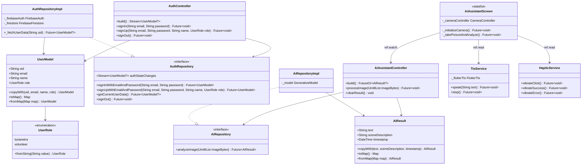

# TemanNetra

TemanNetra is a mobile application developed as a Final Project for the Mobile Programming (Pemrograman Perangkat Bergerak / PPB - E) course. The project provides assistive features for visually impaired individuals and coordination tools for volunteer assistants.

## 🎯 SDG Alignment
* **Target Focus**: **SDG 10: Reduced Inequalities**.
* **Objective**: Facilitate daily independent tasks for visually impaired individuals by offering automated visual analysis and a remote volunteer assistance channel.

## 👥 Development Team & Feature Division
The codebase is structured around a Feature-First modular design. Functional CRUD operations connected to Cloud Firestore and Firebase Storage are allocated as follows:

### Member 1: Naswan Nashir (NRP 5025231219)
* **Module**: Visually Impaired Assistant (Client Side)
* **CRUD Scope**:
  - **Create**: Capture visual data via camera, process text recognition using the Gemini API, or submit a assistance ticket to Cloud Firestore.
  - **Read**: Fetch and playback the user's historical ticket list.
  - **Update**: Modify active ticket descriptions or re-evaluate local visual text analysis.
  - **Delete**: Remove past ticket logs from the database for user privacy.

### Member 2: Sultan Alif (NRP 5025231246)
* **Module**: Volunteer Dashboard (Volunteer Side)
* **CRUD Scope**:
  - **Create**: Record and upload audio/chat responses to Firebase Storage.
  - **Read**: Fetch a list of active unresolved requests in the surrounding area.
  - **Update**: Claim a ticket and transition its execution status.
  - **Delete**: Cancel a claimed ticket prior to resolution.

## ♿ Accessibility Specifications
The interface is designed to support baseline accessibility parameters:
* **Semantics**: Wrapped critical interactive components in Flutter's `Semantics` widget for TalkBack/VoiceOver compatibility.
* **Contrast**: High-contrast black and gold themes to assist low-vision users.
* **Tap Targets**: Touch targets conform to a minimum size of 64x64 dp to reduce misclicks.
* **Haptics**: Brief vibration triggers upon successful database actions.

## 🔌 Architecture & Core Tech Stack
* **State Management**: Riverpod (via code generation).
* **Database & Storage**: Firebase Authentication, Cloud Firestore, and Firebase Storage.
* **APIs**: Gemini Developer API (OCR/Text recognition) and Firebase Cloud Messaging (FCM).

## 📊 Class Diagram
The following class diagram represents the modular, clean architecture architecture of TemanNetra (Authentication module, AI Assistant module, and shared accessibility utility services):



## 🛠️ Local Development Setup

Platform configurations and API credentials are excluded from version control. Follow these steps to initialize the project locally:

### 1. Clone the Repository
```bash
git clone https://github.com/re1c/TemanNetra.git
cd TemanNetra
```

### 2. Configure Firebase Credentials
Place your project config files in:
* **Android**: `android/app/google-services.json`
* **iOS**: `ios/Runner/GoogleService-Info.plist`

### 3. Setup Gemini API Key
Create a `.env` file in the root directory:
```properties
GEMINI_API_KEY=your_gemini_api_key_here
```

### 4. Build Code Generation
```bash
flutter pub get
dart run build_runner build --delete-conflicting-outputs
```

### 5. Run the Application
```bash
flutter run
```
